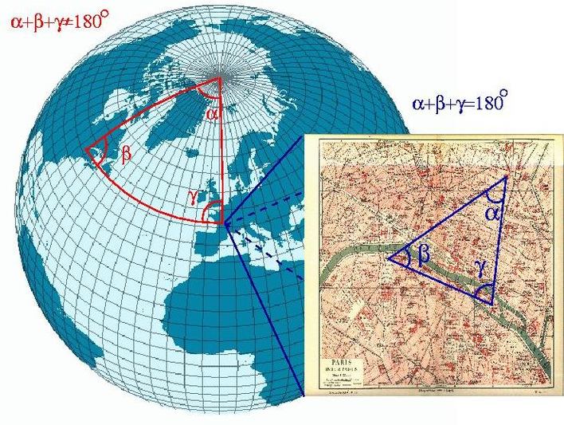

# Spherical Geometries

**Learning objectives:**

* Consider geometries on a sphere


```{r ch4_setup, echo = TRUE, message = FALSE, warning = FALSE}
library("dplyr")
library("ggplot2")
library("maps")
library("rnaturalearth")
library("rnaturalearthdata")
library("s2")
library("sf")

sessionInfo()
```

## Straight Lines

> 1. How does the GeoJSON format (Butler et al. 2016) define “straight” lines between ellipsoidal coordinates (Section 3.1.1)? Using this definition of straight, how does LINESTRING(0 85,180 85) look like in an Arctic polar projection? How could this geometry be modified to have it cross the North Pole?

```{r}
this_linestring <- st_linestring(matrix(c(0, 85, 180, 85), ncol = 2),
                                 dim = "XY")
class(this_linestring)
```

```{r, echo = FALSE, eval = FALSE}
# this_linestring <- st_linestring(rbind(c(0,180), c(85, 85)))
# this_linestring2 <- data.frame(x = c(0,180), y = c(85, 85)) |>
#   st_as_sf(coords = c("x", "y"), na.fail = FALSE, crs = "epsg:3995")
```


```{r}
this_linestring |>
  ggplot() +
  geom_sf(color = "red", linewidth = 3) +
  labs(title = "This Linestring",
       subtitle = "Where is it?",
       caption = "Spatial Data Science book club") +
  theme_minimal()
```

```{r}
# https://stackoverflow.com/questions/58919102/map-arctic-subarctic-regions-in-ggplot2-with-lambert-conformal-conic-projection
world <- ne_countries(scale = "medium", returnclass = "sf")
world_cropped <- world |>
  st_make_valid() |>
  st_crop(xmin = -180.0, xmax = 180.0, ymin = 45.0, ymax = 90.0)

# st_sfc(this_linestring) <- st_crs(world_cropped)

# this_linestring_sf <- st_sf(this_linestring, 
#                             st_sfc(this_linestring, crs = "EPSG:3995"))

ggplot(data = world_cropped) + 
  geom_sf() + 
  # geom_sf(data = this_linestring, color = 'red') +
  coord_sf(crs = 
             "+proj=lcc +lat_1=50 +lat_2=70 +lat_0=40 +lon_0=-96 +x_0=0 +y_0=0 +datum=NAD83 +units=m +no_defs +ellps=GRS80 +towgs84=0,0,0")
```


## Ring Direction

For a typical polygon on $S^2$, how can you find out ring direction?

* A convention here is to define the inside as the left (or right) side of the polygon boundary when traversing its points in sequence. Reversal of the node order then switches inside and outside.

* Additional resource: [ESRI: Polygon page](http://esri.github.io/geometry-api-java/doc/Polygon.html)


## Bounding Boxes

```{r}
Antarctica_map <- map(fill = TRUE, plot = FALSE) |>
  st_as_sf() |>
  filter(ID == "Antarctica")

Antarctica_map |> 
  ggplot() + 
  geom_sf() +
  labs(title = "Antarctica", 
       subtitle = "Think of the latitude",
       caption = "Spatial Data Science book club")
```

```{r}
st_bbox(Antarctica_map)
```

which clearly does not contain the region (ymin being -90 and xmax 180).

```{r}
Fiji_map <- map(fill = TRUE, plot = FALSE) |>
  st_as_sf() |>
  filter(ID == "Fiji")

Fiji_map |> 
  ggplot() + 
  geom_sf() +
  labs(title = "Fiji", 
       subtitle = "Think of the longitude",
       caption = "Spatial Data Science book club")
```

```{r}
st_bbox(Fiji_map)
```

seems to span most of the Earth


### Spherical Coordinates

```{r}
s2_bounds_cap(Antarctica_map)
```

```{r}
s2_bounds_rect(Antarctica_map)
```

```{r}
s2_bounds_rect(Fiji_map)
```


## Validity

Maps of Antarctica should probably display the South Pole. Do the following maps display the South Pole?

### Planar (Ellipsoidal Coordinates)

```{r}
# maps package
m <- st_as_sf(map(fill=TRUE, plot=FALSE))
Antarctica_map_A <- m[m$ID == "Antarctica", ]
st_geometry(Antarctica_map_A) |>
  ggplot() + 
  geom_sf() +
  labs(title = "Antarctica", 
       subtitle = "Think of the latitude",
       caption = "Spatial Data Science book club")
```

```{r}
sf::st_is_valid(Antarctica_map_A)
```


```{r}
# Natural Earth package
ne <- ne_countries(returnclass = "sf")
Antarctica_map_B <- ne[ne$region_un == "Antarctica", "region_un"]
st_geometry(Antarctica_map_B) |>
  ggplot() + 
  geom_sf() +
  labs(title = "Antarctica", 
       subtitle = "Think of the latitude",
       caption = "Spatial Data Science book club")
```
```{r}
sf::st_is_valid(Antarctica_map_B)
```

### Spherical (Polar Stereographic Projection)

```{r}
Antarctica_map_C <- st_geometry(Antarctica_map_A) |>
  st_transform(3031)
Antarctica_map_C |> 
  ggplot() + 
  geom_sf() +
  labs(title = "Antarctica", 
       subtitle = "Think of the latitude",
       caption = "Spatial Data Science book club")
```

```{r}
sf::st_is_valid(Antarctica_map_C)
```

```{r}
Antarctica_map_D <- st_geometry(Antarctica_map_B) |>
  st_transform(3031)
Antarctica_map_D |> 
  ggplot() + 
  geom_sf() +
  labs(title = "Antarctica", 
       subtitle = "Think of the latitude",
       caption = "Spatial Data Science book club")
```

```{r}
sf::st_is_valid(Antarctica_map_D)
```

## Meeting Videos {-}

### Cohort 1 {-}

`r knitr::include_url("https://www.youtube.com/embed/URL")`

<details>
<summary> Meeting chat log </summary>

```
LOG
```
</details>
