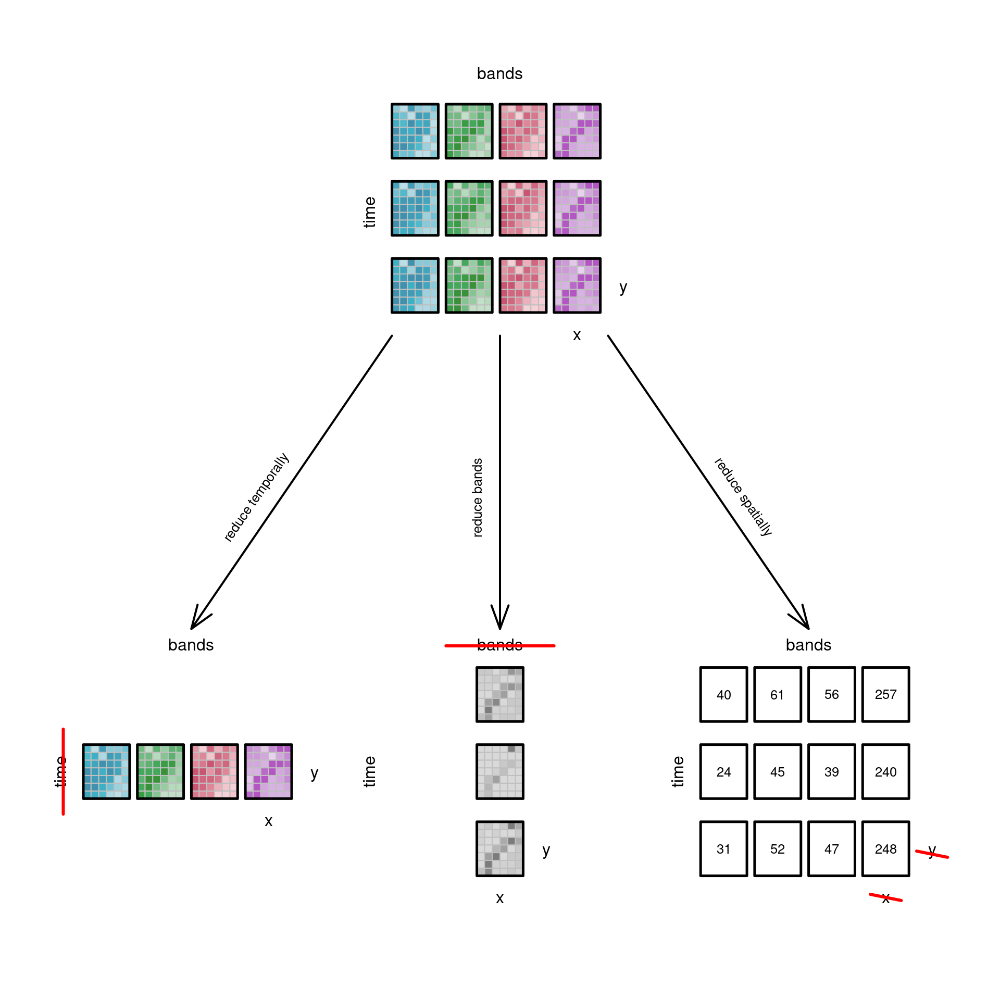

# Data Cubes

**Learning objectives:**

-   

## A four-dimensional data cube {.unnumbered}

-   The world is a four-dimensional space, with three space dimensions and one time dimension.
-   Data cubes are arrays with one or more array dimensions associated with space and/or time.
-   But we really mean hypercubes (or hyper-rectangles) because we rarely deal with three-dimensional structures.

```{r, echo=FALSE}
# (C) 2019, Edzer Pebesma, CC-BY-SA
set.seed(1331)
library(stars) |> suppressPackageStartupMessages()
library(colorspace)
tif <- system.file("tif/L7_ETMs.tif", package = "stars")
r <- read_stars(tif)

nrow <- 5
ncol <- 8
m <- r[[1]][1:nrow,1:ncol,1]
dim(m) <- c(x = nrow, y = ncol) # named dim
s <- st_as_stars(m)
# s
attr(s, "dimensions")[[1]]$delta = 3
attr(s, "dimensions")[[2]]$delta = -.5
attr(attr(s, "dimensions"), "raster")$affine = c(-1.2, 0.0)

plt <- function(x, yoffset = 0, add, li = TRUE) {
    attr(x, "dimensions")[[2]]$offset = attr(x, "dimensions")[[2]]$offset + yoffset
    l <- st_as_sf(x, as_points = FALSE)
    pal <- sf.colors(10)
    if (li)
        pal <- lighten(pal, 0.3 + rnorm(1, 0, 0.1))
    if (! add)
        plot(l, axes = FALSE, breaks = "equal", pal = pal, reset = FALSE, border = grey(.75), key.pos = NULL, main = NULL, xlab = "time")
    else
        plot(l, axes = TRUE, breaks = "equal", pal = pal, add = TRUE, border = grey(.75))
    u <- st_union(l)
    # print(u)
    plot(st_geometry(u), add = TRUE, col = NA, border = 'black', lwd = 2.5)
}

pl <- function(s, x, y, add = TRUE, randomize = FALSE) {
  attr(s, "dimensions")[[1]]$offset = x
  attr(s, "dimensions")[[2]]$offset = y
  m <- r[[1]][y + 1:nrow,x + 1:ncol,1]
  if (randomize)
    m <- m[sample(y + 1:nrow),x + 1:ncol]
  dim(m) = c(x = nrow, y = ncol) # named dim
  s[[1]] = m
  plt(s, 0, add)
  plt(s, 1, TRUE)
  plt(s, 2, TRUE)
  plt(s, 3, TRUE)
  plt(s, 4, TRUE)
  plt(s, 5, TRUE)
  plt(s, 6, TRUE)
  plt(s, 7, TRUE)
  plt(s, 8, TRUE, FALSE)
}

plot.new()
par(mar = rep(0.5,4))
plot.window(xlim = c(-12,15), ylim = c(-5,10), asp=1)
pl(s, 0, 0)
# box()
text(-10, 0, "time", srt = -90, col = 'black')
text(-5,  6.5, "latitude", srt = 25, col = 'black')
text( 5,  8.5, "longitude", srt = 0, col = 'black')
```

> Colour image data always has three bands(blue, green, red) and we added near infrarred (nir). Here we show a four dimensional cube layed flat as a facet plot. Two dimensions (x and y) are aligned with the dimensions bands and time.


## Dimensions, attributes, and support {.unnumbered}

-   Depending on the data that we are dealing with (discrete or continuous), we may have the following data structures:
    -   time series, depicted as time lines for functions of time\
    -   image or raster data for two-dimensional spatial data\
    -   time sequences of images for dynamic spatial data (spatio-temporal array or data cube)

Here, a variable Z depends on x,y, and t. The variables from the range (x,y,t) are the cube dimensions.

$$
Z = f(x,y,t)  
$$

$$
\{ Z_1, Z_2, ..., Z_p \} = f(x,y,t)
$$

And if we have multiple time dimensions then we represent each with $D_x$. For example, when we are splitting time in years, day-of-year, hour-of-day.

$$
\{ Z_1, Z_2, ..., Z_p \} = f(D_1, D_2, ... , D_n)
$$

We deal with datasets with one or more space dimensions and zero or more time dimensions as data cubes:

-   simple features

-   time series for sets of features

-   raster data

-   multi-spectral raster data (images)

-   time series of multi-spectral raster data (video)

    ## Operations on data cubes {.unnumbered}

### Slicing a cube: filter {.unnumbered}

-   Data cubes can be sliced into sub-cubes by fixing a dimension at a particular value.


### Applying functions to dimensions {.unnumbered}

-   Functions such as `abs`, `sin`, or `sqrt` is applied to all values in the cube.\
-   Summarising functions such as `mean` to the entire cube and returns a single value/s.

### Reducing dimensions {.unnumbered}

-   When applying a function like `mean` the cube reduces its dimensionality to zero.\
-   The following example shows estimating NDVI across time, bands, or averaging all pixels on each raster.



## Aggregating raster to vector cubes {.unnumbered}

-   We can start with a four-dimensional data cube and aggregate (reduce) it to a three-dimensional vector data cube:
    -   Pixels in the raster are grouped by spatial intersection with a set of vector geometries, and each group is then reduced to a single value by an aggregation function such as `mean` or `max`.

 

- Examples of vector data cubes are: 
  - air quality data with $PM_{10}$ over two dimensions, as a sequence of monitoring stations or time intervals,  
  - demographic data consisting of counts, with number of persons by regions for a sequence of n regions, age class, for m age classes, and year for p years. This would create an array with nmp elements. 

- Examples of changing dimensions:  
  - interpolating air quality measurements to values on a regular grid,  
  - estimating number of flights passing by per week within a range of 1 km,  
  - combining Earth observation data form different sensors such as MODIS (250-m pixels every 16 days) with Sentinel-2 (10-m pixels every 5 days).  

- Examples of aggregating one or more dimensions:  
  - which air quality monitoring stations indicate unhealthy conditions (time),  
  - which region has the highest increase in disease incidence (space, time),  
  - global warming (global change in degrees Celsius per decade). 


## Switching dimension with attributes {.unnumbered}

- Be careful when applying a function to a data cube, if a dimension has incompatible measurement units across then it makes no sense to summarise them by estimating the `mean` of values to reduce parameter dimension. Instead, counting the number of variables that exceed a threshold might be more useful. 

- Some dimensions may be categorical too! 


## Other dynamic spatial data {.unnumbered}

- Some data may not match a data cube structure.  
- For example, spatiotemporal point patterns and trajectories.  
- For these, the primary information is in the coordinates! 

### Spatiotemporal point patterns {-}

- A set of spatiotemporal coordinates of events or objects (e.g., accidents, disease cases). 

### Trajectory data {-}

- Trajectory data are time sequences of spatial locations of moving objects (e.g., people, animals, cars). 

## Meeting Videos {.unnumbered}

### Cohort 1 {.unnumbered}

`r knitr::include_url("https://www.youtube.com/embed/URL")`

<details>

<summary>Meeting chat log</summary>

```         
LOG
```

</details>
