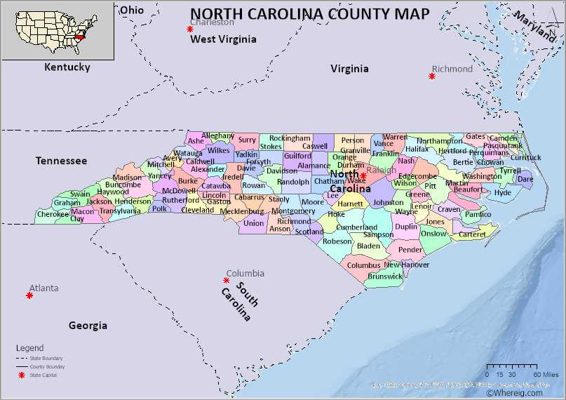
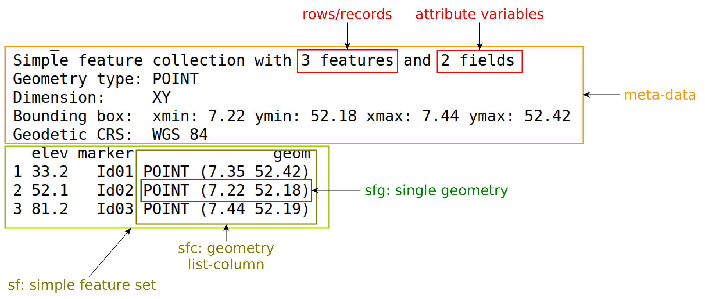
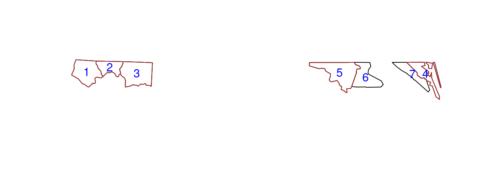
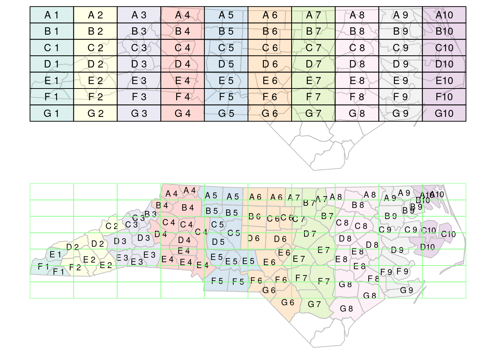
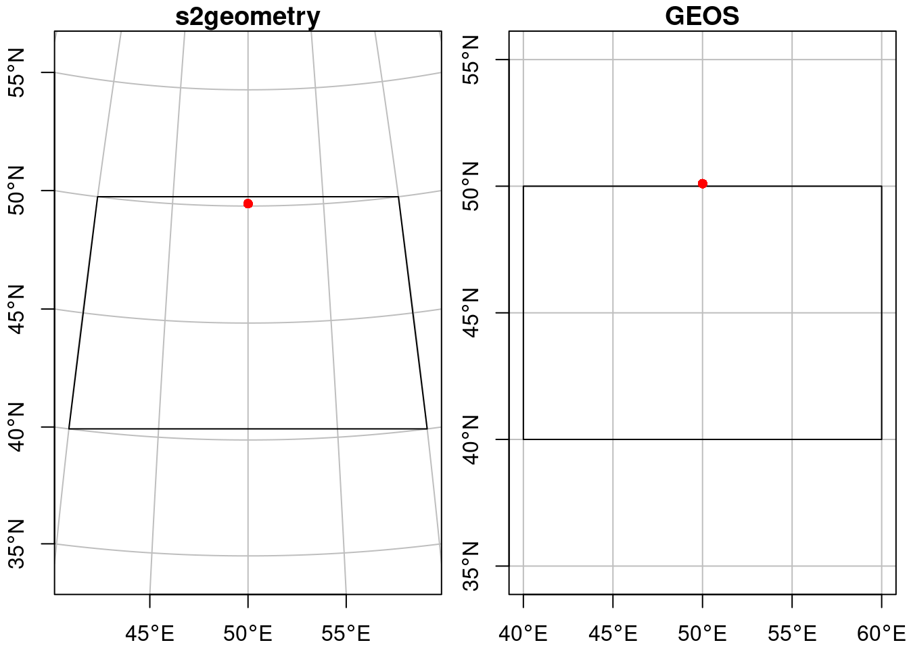
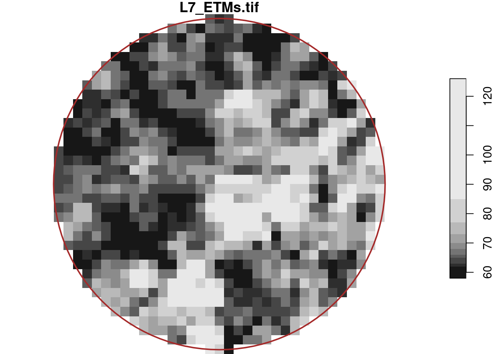
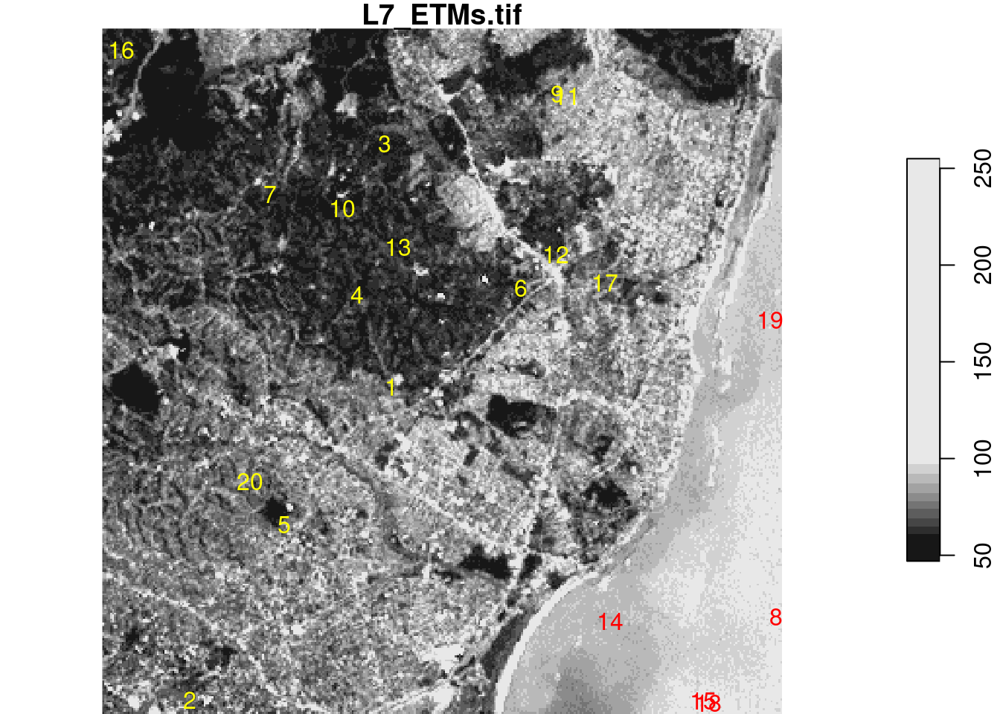
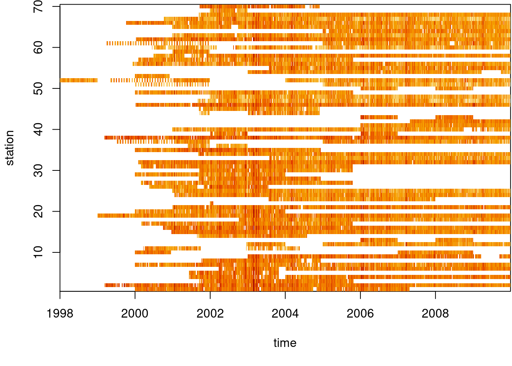
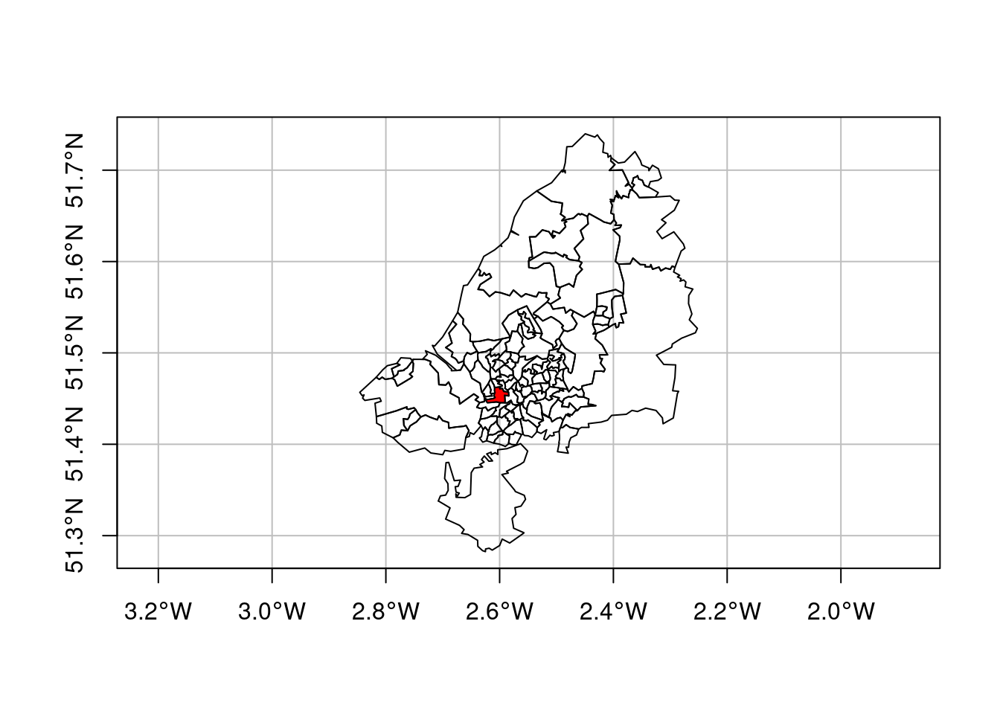

# Introduction to sf and stars



]

```{r, message = FALSE, warning = FALSE}
library("cubelyr")
library("dplyr") #data wrangling
library("MASS")  #linear discriminant analysis
library("sf")    #simple features
library("spDataLarge") #contains Bristol data
library("stars") #useful for rasters and data cubes
library("tidyr") #pivoting
library("units")
library("xts")   #time series tools

sessionInfo()
```


## sf

**sf** provides *simple feature*  access

* replaces packages `sp`, `rgeos`, `rgdal`
* interface with `tidyverse`
* geometrical operations with GEOS or s2geometry
* coordinate transformations

**sf** objects have

* `data.frame` or `tibble`
* `sfc`: geometry list-column

### Metadata

* `sf_column`: the name of the (active) geometry column
* `agr`: attribute-geometry relationship



## Example: North Carolina

```{r}
# reading in an sf object
nc <- st_read(system.file("gpkg/nc.gpkg", package = "sf"))
```

### Subsetting

```{r, eval = FALSE}
nc[2:5, 3:7] #records 2-5 and columns 3-7 
```



<details>
<summary>Code</summary>
```{r}
nc5 <- nc[1:5, ]
nc7 <- nc[1:7, ]
plot(st_geometry(nc7))
plot(st_geometry(nc5), add = TRUE, border = "brown")
cc = st_coordinates(st_centroid(st_geometry(nc7)))
text(cc, labels = 1:nrow(nc7), col = "blue")
```
</details>

* the `drop` argument is by default `FALSE` meaning that the geometry column is always selected
* selection with a spatial (`sf`, `sfc`, or `sfg`) object as first argument leads to selection of the features that *spatially intersect* with that object

```{r}
(i <- st_intersects(nc5, nc7))
```

```{r}
as.matrix(i)
```

```{r}
# The object i is of class sgbp (sparse geometrical binary predicate)
class(i)
```

```{r}
methods(class = "sgbp")
```

## tidyverse

Package sf has `tidyverse`-style read and write functions, `read_sf` and `write_sf` that

* return a tibble rather than a data.frame
* do not print any output
* overwrite existing data by default

The `dplyr`, `ggplot2`, and `tidyr` capabilities are probably familiar for this audience, but there are some extra considerations for `sf` data below.

### summarise

The `summarise` method for sf objects has two special arguments:

* `do_union` (default `TRUE`) determines whether grouped geometries are unioned on return, so that they form a valid geometry
* `is_coverage` (default `FALSE`) in case the geometries grouped form a coverage (do not have overlaps), setting this to `TRUE` speeds up the unioning

### filter

We can use `filter` for spatial predicates.  For example, to select all counties less than 50 km away from Orange County,

```{r}
# filters
orange <- nc |> dplyr::filter(NAME == "Orange")
wd <- st_is_within_distance(nc, orange, 
                            units::set_units(50, km))
o50 <- nc |> dplyr::filter(lengths(wd) > 0)

# plot
og <- st_geometry(orange)
buf50 <- st_buffer(og, units::set_units(50, km))
all <- c(buf50, st_geometry(o50))
plot(st_geometry(o50), lwd = 2, extent = all)
plot(og, col = 'orange', add = TRUE)
plot(buf50, add = TRUE, col = NA, border = 'brown')
plot(st_geometry(nc), add = TRUE, border = 'grey')
```

### distinct

The `distinct` method selects distinct records, where `st_equals` is used to evaluate distinctness of geometries.

## Spatial Joins

* The concepts of “left”, “right”, “inner”, or “full” joins remain

When using spatial joins, each record may have several matched records ... A way to reduce this complexity may be to select from the matching records the one with the *largest overlap* with the target geometry.

<details>
<summary>Loading shapefile and grid</summary>
```{r}
system.file("shape/nc.shp", package="sf") |> 
    read_sf() |>
    st_transform('EPSG:2264') -> nc
gr <- st_sf(
         label = apply(expand.grid(1:10, LETTERS[10:1])[,2:1], 1, paste0, collapse = ""),
         geom = st_make_grid(nc))
gr$col <- sf.colors(10, categorical = TRUE, alpha = .3)
# cut, to verify that NA's work out:
gr <- gr[-(1:30),]
```
</details>

```{r, message = FALSE, warning = FALSE}
nc_j <- st_join(nc, gr, largest = TRUE)
```



<details>
<summary>image code</summary>
```{r, eval = FALSE}
par(mfrow = c(2,1), mar = rep(0,4))
plot(st_geometry(nc_j), border = 'grey')
plot(st_geometry(gr), add = TRUE, col = gr$col)
text(st_coordinates(st_centroid(st_geometry(gr))), labels = gr$label, cex = .85)
# the joined dataset:
plot(st_geometry(nc_j), border = 'grey', col = nc_j$col)
text(st_coordinates(st_centroid(st_geometry(nc_j))), labels = nc_j$label, cex = .7)
plot(st_geometry(gr), border = '#88ff88aa', add = TRUE)
```
</details>

## Creation

An `sf` object can be created from scratch by

```{r}
p1 <- st_point(c(7.35, 52.42))
p2 <- st_point(c(7.22, 52.18))
p3 <- st_point(c(7.44, 52.19))
sfc <- st_sfc(list(p1, p2, p3), crs = 'OGC:CRS84')
st_sf(elev = c(33.2, 52.1, 81.2), 
      marker = c("Id01", "Id02", "Id03"), geom = sfc)
```

Convenience functions

* `st_sample`
* `st_make_grid`
* `st_interpoloate_aw`


## Ellipsoidal Coordinates

```{r}
"POINT(50 50.1)" |> st_as_sfc(crs = "OGC:CRS84") -> pt
```



<details>
<summary>image code</summary>
```{r, eval = FALSE}
par(mfrow = c(1, 2))
par(mar = c(2.1, 2.1, 1.2, .5))
ortho <- st_crs("+proj=ortho +lon_0=50 +lat_0=45")
pol |> st_transform(ortho) |> plot(axes = TRUE, graticule = TRUE, 
                                   main = 's2geometry')
pt |> st_transform(ortho) |> plot(add = TRUE, pch = 16, col = 'red')
# second plot:
plot(pol, axes = TRUE, graticule = TRUE, main = 'GEOS')
plot(pt, add = TRUE, pch = 16, col = 'red')
```
</details>


By default, `sf` uses geometrical operations from the `s2geometry` library, interfaced through the `s2` package

```{r}
"POLYGON((40 40, 60 40, 60 50, 40 50, 40 40))" |>
  st_as_sfc(crs = "OGC:CRS84") -> pol
st_intersects(pt, pol) #TRUE
```

If one wants sf to use ellipsoidal coordinates as if they are Cartesian coordinates, the use of s2 can be switched off

```{r, eval = FALSE}
old <- sf_use_s2(FALSE)
# Spherical geometry (s2) switched off
st_intersects(pol, pt)
# although coordinates are longitude/latitude, st_intersects assumes
# that they are planar
# Sparse geometry binary predicate list of length 1, where the
# predicate was `intersects'
#  1: (empty)
sf_use_s2(old) # restore
# Spherical geometry (s2) switched on
```

## stars

* For the classic GIS view of raster layers, `terra` package

Capabilities of `stars` include


* allows for representing dynamic (time varying) **raster stacks**
* aims at being *scalable*, also beyond local disk size
* provides a strong integration of raster functions in the `GDAL` library
* handles, in addition to regular grids, rotated, sheared, rectilinear, and **curvilinear rasters**
* provides a tight integration with package `sf`
* handles array data with non-raster spatial dimensions, the vector **data cubes**
* follows the `tidyverse` design principles

## Example: Olinda, Brazil

```{r}
r <- read_stars(system.file("tif/L7_ETMs.tif", package = "stars"))
r
```

<details>
<summary>attributes</summary>

* `from`: starting index
* `to`: ending index
* `offset`: dimension value at the start (edge) of the first pixel
* `delta`: cell size; negative delta values indicate that pixel index increases with decreasing dimension values
* `refsys`: reference system
* `point`: logical, indicates whether cell values have point support or cell support
* `x/y`: indicates whether a dimension is associated with a spatial raster x- or y-axis

</details>

### Plots

```{r}
plot(r)
```

```{r}
par(mfrow = c(1, 2))
plot(r, rgb = c(3,2,1), reset = FALSE, main = "RGB")    # rgb
plot(r, rgb = c(4,3,2), main = "False colour (NIR-R-G)") # false colour
```


### Subsetting

Example: selects from `r`

* attributes 1-2, index 101-200 for dimension 1, and index 5-10 for dimension 3
* omitting dimension 2 means that no subsetting takes place

```{r, eval = FALSE}
r[1:2, 101:200,, 5:10]
```

Selecting discontinuous ranges is supported only when it is a regular sequence

```{r}
r[,1:100, seq(1, 250, 5), 4] |> dim() #default behavior
r[,1:100, seq(1, 250, 5), 4, drop = TRUE] |> dim()
```

For selecting particular ranges of dimension values, one can use `dplyr::filter`

```{r}
filter(r, x > 289000, x < 290000)
```

or `slice`

```{r}
slice(r, band, 3)
```

### Cropping

```{r}
b <- st_bbox(r) |>
    st_as_sfc() |>
    st_centroid() |>
    st_buffer(units::set_units(500, m))
r[b]
```



<details>
<summary>image code</summary>
```{r, eval = FALSE}
plot(r[b][,,,1], reset = FALSE)
plot(b, border = 'brown', lwd = 2, col = NA, add = TRUE)
```

By default, the resulting raster is cropped to the extent of the selection object; otherwise

```{r}
r[b, crop = FALSE]
```

```{r}
# we can reset dimension offsets
r[b] |> st_normalize() |> st_dimensions()
```

</details>

or simply using the `stars` function made for cropping

```{r, eval = FALSE}
st_crop(r, b)
```

## Redimensioning

* `aperm`: transposes an array by permuting the order of dimensions
* Attributes and dimensions can be swapped, using `split` and `merge`

```{r}
(rs <- split(r))
```

```{r}
merge(rs, name = "band") |> setNames("L7_ETMs")
```

* Multiple `stars` object with identical dimensions can be combined using `c`

## Extraction

A very common use case for raster data cube analysis is the extraction of values at certain locations, or computing aggregations over certain geometries

```{r}
set.seed(115517)
pts <- st_bbox(r) |> st_as_sfc() |> st_sample(20)
(e <- st_extract(r, pts))
```

## Predictive Models



<details>
<summary>image code</summary>
```{r, eval = FALSE}
plot(r[,,,1], reset = FALSE)
col <- rep("yellow", 20)
col[c(8, 14, 15, 18, 19)] = "red"
st_as_sf(e) |> st_coordinates() |> text(labels = 1:20, col = col)
```
</details>

```{r}
rs <- split(r)
trn <- st_extract(rs, pts)
trn$cls <- rep("land", 20)
trn$cls[c(8, 14, 15, 18, 19)] <- "water"
model <- MASS::lda(cls ~ ., st_drop_geometry(trn)) #linear discriminant analysis
pr <- predict(rs, model)
plot(pr[1], key.pos = 4, key.width = lcm(3.5), key.length = lcm(2))
```


## Computations

* logarithmic transformation: `log(r)`
* mask:

```{r}
r2 <- r
r2[r < 50] <- NA
```

* unmask:

```{r}
r2[is.na(r2)] <- 0
```


## Aggregation

Dimension-wise, we can apply functions to selected array dimensions

```{r}
st_apply(r, c("x", "y"), mean)
```

Example: NDVI (normalised differenced vegetation index)

```{r}
ndvi <- function(b1, b2, b3, b4, b5, b6) (b4 - b3)/(b4 + b3)
st_apply(r, c("x", "y"), ndvi)
```


Aggregation over a **temporal dimension** is done by passing a time variable as the second argument to `aggregate`, as a

* set of time stamps indicating the start of time intervals,
* set of time intervals defined by `make_intervals`, or
* time period like `"weeks"`, `"5 days"`, or `"years"`.


## Example: Air Quality

We use a small excerpt from the European air quality data base to illustrate aggregation operations on vector data cubes. The same data source was used by Gräler, Pebesma, and Heuvelink (2016)

```{r}
load("data/air.rda")
de_nuts1 <- read_sf("data/de_nuts1.gpkg")
dim(air)
```

```{r}
stations |>
    st_as_sf(coords = c("longitude", "latitude"), crs = 4326) |>
    st_geometry() -> st
d <- st_dimensions(station = st, time = dates)
(aq <- st_as_stars(list(PM10 = air), dimensions = d))
```



<details>
<summary>image code</summary>
```{r, eval = FALSE}
par(mar = c(5.1, 4.1, 0.3, 0.1))
image(aperm(log(aq), 2:1), main = NULL)
```
</details>


<details>
<summary>image code</summary>
```{r, eval = FALSE}
st_as_sf(st_apply(aq, 1, mean, na.rm = TRUE)) |>
    plot(reset = FALSE, pch = 16, extent = de_nuts1)
st_union(de_nuts1) |> plot(add = TRUE)
```
</details>

Example: aggregate these station time series to area means

```{r}
(a <- aggregate(aq, de_nuts1, mean, na.rm = TRUE))
```

Example:  show the maps for six arbitrarily chosen days

```{r}
a |> filter(time >= "2008-01-01", time < "2008-01-07") |> 
    plot(key.pos = 4)
```

Example: time series plot of mean values for a single state

```{r}
plot(as.xts(a)[,4], main = de_nuts1$NAME_1[4])
```


## Example: Transportation



<details>
<summary>image code</summary>
```{r, eval = FALSE}
plot(st_geometry(bristol_zones), axes = TRUE, graticule = TRUE)
plot(st_geometry(bristol_zones)[33], col = 'red', add = TRUE)
```
</details>

```{r}
head(bristol_od)
```

### Preprocessing

```{r}
# create O-D-mode array:
bristol_tidy <- bristol_od |> 
    dplyr::select(-all) |> #caution: MASS also has select()
    pivot_longer(3:6, names_to = "mode", values_to = "n")
head(bristol_tidy)
```

Next, we form the three-dimensional array

* filled with zeroes (at first)
* dimensions are named with the zone names (o, d) and the transportation mode name (mode)
* ensure order of observations in `bristol_zones` and `bristol_tidy`

```{r}
od <- bristol_tidy |> pull("o") |> unique()
nod <- length(od)
mode <- bristol_tidy |> pull("mode") |> unique()
nmode = length(mode)
a = array(0L,  c(nod, nod, nmode), 
    dimnames = list(o = od, d = od, mode = mode))

a[as.matrix(bristol_tidy[c("o", "d", "mode")])] <-  bristol_tidy$n

order <- match(od, bristol_zones$geo_code)
zones <- st_geometry(bristol_zones)[order]
```

### stars object

```{r}
d <- st_dimensions(o = zones, d = zones, mode = mode)
odm <- st_as_stars(list(N = a), dimensions = d)
```

```{r}
# plot, sliced for destination zone 33
plot(adrop(odm[,,33]) + 1, logz = TRUE)
```

Example: largest number of travellers as its destination

```{r}
d <- st_apply(odm, 2, sum)
which.max(d[[1]])
```

Example: Total transportation by OD

```{r}
st_apply(odm, 1:2, sum)
```

Example: Origin totals, by mode

```{r}
st_apply(odm, c(1,3), sum)
```

Example: Destination totals, by mode

```{r}
st_apply(odm, c(2,3), sum)
```

Plotting the origins and destinations:

```{r}
o <- st_apply(odm, 1, sum)
d <- st_apply(odm, 2, sum)
x <- (c(o, d, along = list(od = c("origin", "destination"))))
plot(x, logz = TRUE)
```

### Normalization

```{r}
a <- set_units(st_area(st_as_sf(o)), km^2)
o$sum_km <- o$sum / a
d$sum_km <- d$sum / a
od <- c(o["sum_km"], d["sum_km"], along = 
        list(od = c("origin", "destination")))
plot(od, logz = TRUE)
# Total commutes per square km, by area of origin (left) or destination (right)
```


## Vector to Raster

```{r}
file <- system.file("gpkg/nc.gpkg", package="sf")
read_sf(file) |> 
  st_geometry() |>
  st_as_stars() |>
  plot(key.pos = 4)
```

Rasterising existing features is done using `st_rasterize`

```{r}
read_sf(file) |>
  dplyr::mutate(name = as.factor(NAME)) |>
  dplyr::select(SID74, SID79, name) |>
  st_rasterize()
```

Similarly, line and point geometries can be rasterised

```{r}
read_sf(file) |>
  st_cast("MULTILINESTRING") |>
  dplyr::select(CNTY_ID) |>
  st_rasterize() |>
  plot(key.pos = 4)
```


## Meeting Videos {-}

### Cohort 1 {-}

`r knitr::include_url("https://www.youtube.com/embed/URL")`

<details>
<summary> Meeting chat log </summary>

```
LOG
```
</details>
