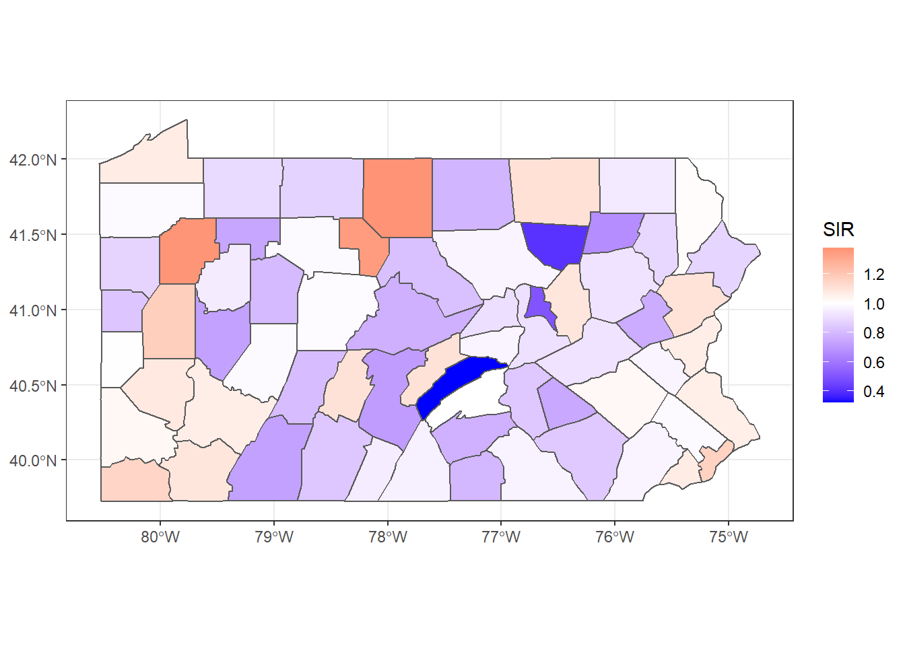
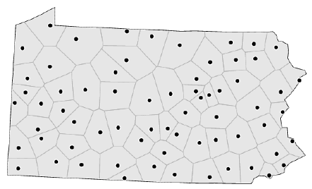

# Proximity and Areal Data

**Learning objectives:**

* consider the definition of areal data
* discuss matters of graph theory
* explore various methods of finding neighbors

```{r, message = FALSE, warning = FALSE}
library("dbscan")     #density-based clustering
library("igraph")     #graph networks
library("Matrix")     #for sparse representation
library("sf")         #simple features
library("spatialreg") #spatial regression analysis
library("spdep")      #spatial dependence
library("tmap")       #quick, thematic maps

data(pol_pres15, package = "spDataLarge") #Poland 2015 election data

sessionInfo()
```


## Areal Data

*Areal units* of observation are very often used when simultaneous observations are aggregated within non-overlapping boundaries. 

**Example:** Lung cancer SIR (standardized incidence rate) in Pennsylvania



## Proximity Data

By *proximity*, we mean closeness in ways that make sense for the data generation processes thought to be involved. In cross-sectional geostatistical analysis with point support, measured distance makes sense for typical data generation processes.

**Example:** Voronoi diagram of Pennsylvania



## Support

By *support* of data we mean the physical size (length, area, volume) associated with an individual observational unit

* It is possible to represent the support of areal data by a point, despite the fact that the data have polygonal support
* When the intrinsic support of the data is represented as points, but the underlying process is **between proximate observations** rather than driven chiefly by distance between observations
* risk of misrepresenting the footprint of the underlying spatial processes

## Representing Proximity

Ideas for spatial autocorrelation

* (graph theory) undirected graph, and its neighbors, or
* (geospatial) variogram

But what about

* islands?
* disconnected subgraphs?
* sparse areas (cutoff by distance threshold)

## spdep package

`spdep` package: [spatial dependence](https://cran.r-project.org/web/packages/spdep/index.html)

* `nb` class for neighbor

    - list of length `0L` for no neighbors

* `listw` object

    1. `nb` object
    2. list of numerical weights
    3. how the weights were calculated
    
* `spatialreg` package now has the functions for constructing and handling neighbour and spatial weights objects, tests for spatial autocorrelation, and model fitting functions that used to be in `spdep`

    
## Example: Poland 2015 Election

```{r}
pol_pres15 |>
    subset(select = c(TERYT, name, types)) |>
    head()
```

```{r}
# tmap
tm_shape(pol_pres15) + tm_fill("types")
```

For safety’s sake, we impose topological validity:

```{r}
if (!all(st_is_valid(pol_pres15)))
        pol_pres15 <- st_make_valid(pol_pres15)
```


## Contiguous Neighbors

For each observation, the `poly2nb` function checks whether

* at least one (`queen = TRUE`)
* at least two ("rook", `queen = FALSE`)

points are within `snap` distance of each other.

```{r}
pol_pres15 |> poly2nb(queen = TRUE) -> nb_q
```

```{r}
print(nb_q)
```

* `s2` spherical coordinates are used by default
* symmetric relationships assumed
* `row.names` may be customized

### Connected

Are the data connected? (Some model estimation techniques do not support graphs that are not connected.)

```{r, eval = FALSE}
(nb_q |> n.comp.nb())$nc
# result: 1 for TRUE (more than one for FALSE)
```

<details>
<summary>verbose code</summary>
```{r}
#library(Matrix, warn.conflicts = FALSE)
#library(spatialreg, warn.conflicts = FALSE)
nb_q |> 
    nb2listw(style = "B") |> 
    as("CsparseMatrix") -> smat
#library(igraph, warn.conflicts = FALSE)
smat |> graph.adjacency() -> g1

g1 |> count_components()
```

</details>


## Graph-Based Neighbors

The simplest form is by using triangulation, here using the `deldir` package

```{r}
# get centroids and save their coordinates
pol_pres15 |> 
    st_geometry() |> 
    st_centroid(of_largest_polygon = TRUE) -> coords 

# triangulation
(coords |> tri2nb() -> nb_tri)
```

### How Far Away are the Neighbors?

```{r}
# results in meters
nb_tri |> 
    nbdists(coords) |> 
    unlist() |> 
    summary()
```

### Sphere of Influence

The Sphere of Influence `soi.graph` function takes triangulated neighbours and prunes off neighbour relationships represented by edges that are unusually long for each point.

```{r}
(nb_tri |> 
        soi.graph(coords) |> 
        graph2nb() -> nb_soi)
```

```{r}
# Poland
pol_pres15 |> 
    st_geometry() |> 
    plot(border = "grey", lwd = 0.5)
```

```{r}
# triangulation
plot(nb_tri, 
     coords = coords, points = FALSE, lwd = 0.5)
```

```{r}
# sphere of influence
plot(nb_soi, 
     coords = coords, points = FALSE, lwd = 0.5)
```


## Distance-Based Neighbors

* Distance-based neighbours can be constructed using `dnearneigh`, with a distance band with lower `d1=` and upper `d2=` bounds controlled by the `bounds=` argument
* The `knearneigh` function for -nearest neighbours returns a `knn` object, converted to an `nb` object using `knn2nb`
* Computation speed boost through `dbscan` package
* The `nbdists` function returns the length of neighbour relationship edges

```{r}
coords |> 
    knearneigh(k = 1) |> 
    knn2nb() |> 
    nbdists(coords) |> 
    unlist() |> 
    summary()
```

Here the largest first nearest neighbour distance is just under 18 km, so using this as the upper threshold gives certainty that all units will have at least one neighbour.

```{r}
# maybe no neighbors
coords |> dnearneigh(0, 16000) -> nb_d16

# at least one neighbor
coords |> dnearneigh(0, 18000) -> nb_d18
```

* Adding 300 m to the threshold gives us a neighbour object with no no-neighbour units, and all units can be reached from all others across the graph.

```{r}
# connected graph
coords |> dnearneigh(0, 18300) -> nb_d183
```

It is possible to control the numbers of neighbours directly using -nearest neighbours, either accepting asymmetric neighbours

```{r}
coords |> knearneigh(k = 6) -> knn_k6

# asymmetrical
knn_k6 |> knn2nb() -> nb_k6

# symmetrical
knn_k6 |> knn2nb(sym = TRUE) -> nb_k6s
```

## Weights Specification

Once neighbour objects are available, further choices need to be made in specifying the weights objects. 

* The `nb2listw` function is used to create a `listw` weights object with an `nb` object, a matching list of weights vectors, and a style specification
* Because handling no-neighbour observations now begins to matter, the `zero.policy=` argument is introduced (default: `FALSE`)
* `n`: number of observations
* $S_{0}$: sum of weights


The "B" binary style gives a weight of unity to each neighbour relationship, and typically up-weights units with no boundaries on the edge of the study area, having a higher count of neighbours.

```{r}
nb_q |> nb2listw(style = "B") -> lw_q_B

lw_q_B |> 
    spweights.constants() |> 
    data.frame() |> 
    subset(select = c(n, S0))
```

The "W" row-standardised style up-weights units around the edge of the study area that necessarily have fewer neighbours. This style first gives a weight of unity to each neighbour relationship, then it divides these weights by the per unit sums of weights (caution: avoid no-neighbors)

```{r}
nb_q |> nb2listw(style = "W") -> lw_q_W

lw_q_W |> 
    spweights.constants() |> 
    data.frame() |> 
    subset(select = c(n, S0))
```

### Inverse Distance Weights

```{r}
nb_d183 |> 
    nbdists(coords) |> 
    lapply(function(x) 1/(x/1000)) -> gwts
```

No-neighbour handling is by default to prevent the construction of a weights object, making the analyst take a position on how to proceed.

```{r}
(nb_d183 |> nb2listw(glist=gwts, style="B") -> lw_d183_idw_B) |> 
    spweights.constants() |> 
    data.frame() |> 
    subset(select=c(n, S0))
```

Use can be made of the `zero.policy=` argument to many functions used with `nb` and `listw` objects.

```{r}
(nb_d16 |> 
    nb2listw(style="B", zero.policy=TRUE) |> 
    spweights.constants(zero.policy=TRUE) |> 
    data.frame() |> 
    subset(select=c(n, S0)))
```


## Higher-Order Neighbors

If we wish to create an object showing to neighbours, where $i$ is a neighbour of $j$, and $j$ in turn is a neighbour of $k$, so taking two steps on the neighbour graph, we can use `nblag` (automatically removes $i$ to $i$ self-neighbours)

```{r}
nb_q |> nblag(2) -> nb_q2
```

Returning to the graph representation of the same neighbour object, we can ask how many steps might be needed to traverse the graph?

```{r}
igraph::diameter(g1) #where g1 is a graph object
```

We step out from each observation across the graph to establish the number of steps needed to reach each other observation by the shortest path (creating an $n \times n$ matrix `sps`), once again finding the same maximum count.

```{r}
g1 |> shortest.paths() -> sps
sps |> apply(2, max) -> spmax

spmax |> max()
```

The municipality with the maximum count is called Lutowiska, close to the Ukrainian border in the far south east of the country.

```{r}
mr <- which.max(spmax)
pol_pres15$name0[mr]
```

```{r}
pol_pres15$sps1 <- sps[,mr]
tm_shape(pol_pres15) +
          tm_fill("sps1", title = "Shortest path\ncount")
```


## Meeting Videos {-}

### Cohort 1 {-}

`r knitr::include_url("https://www.youtube.com/embed/URL")`

<details>
<summary> Meeting chat log </summary>

```
LOG
```
</details>
